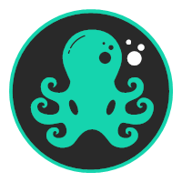
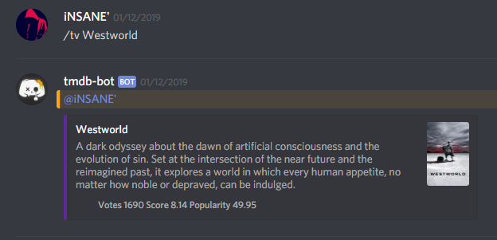

<!--  -->

# Chutulu Bot
>Does a whole bunch of things... if you are brave enough.

## API Implementation

The following APIs are currently implemented in this discord Bot

* FBDB for Football scores and upcoming games (http://api.football-data.org/)
* TMDB for information about TV Shows and Movies (https://api.themoviedb.org/)

## Additional Functionality

* Play any file that is in the ./sounds directory of this repo
* Play any video from youtube (Video audio is automatically streamed by the bot from YT to the voice channel)

## UI Example

Uses the basic Discord Chat to display results:

## Deploy

This Bot runs on docker so simply execute the run the Dockerfile to start up the container, the Bot currently runs on port 8080

## TODO

Use Javascript to add team icons to footballDB requests and build standings for the leagues on request